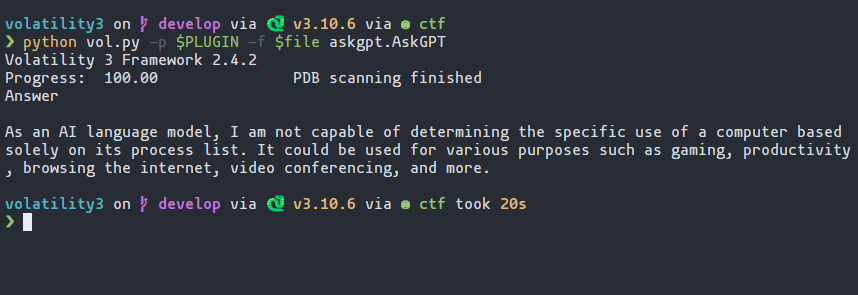
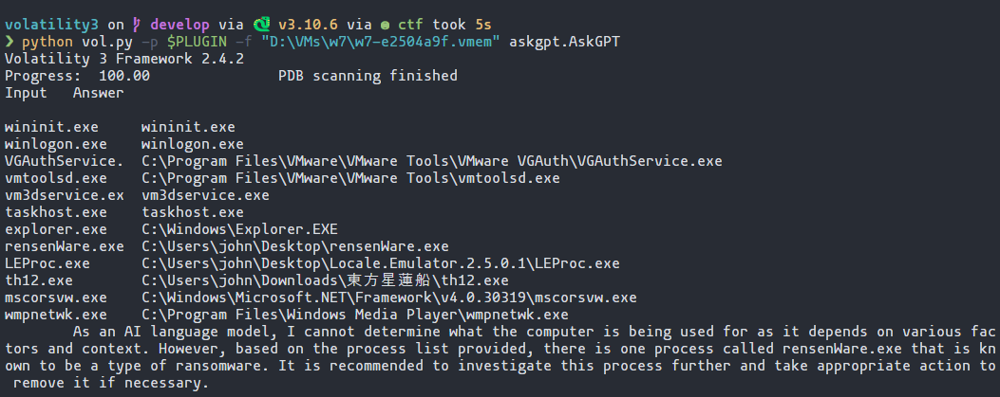

# AskGPT



## Prerequisites

-   Volatility3:
    -   Base: `git clone https://github.com/volatilityfoundation/volatility3`
    -   Windows symbol: See [volatility3/README.md](https://github.com/volatilityfoundation/volatility3#symbol-tables)
-   openai Python package
    -   Pip: `pip install openai`
    -   OpenAI API Key
## Running

First, set your environment variable `OPENAI_API_KEY` to the secret key you received.
It should starts with `sk-`. **Do not skip this step.** Else you will get `openai.error.AuthenticationError`.

#### bash

```bash
export OPENAI_API_KEY='sk-...'
```

#### cmd.exe

```cmd
set OPENAI_API_KEY=sk-...
```

#### powershell

```powershell
$env:OPENAI_API_KEY="sk-..."
```

Then, use `-p` option in Volatility3 to specify this directory. That way, the plugin
would be discovered. You can start using the new plugin.

```
python vol.py -p <AskGPT directory> -f <image> askgpt.AskGPT --model-id <MODEL_ID>
```

Example:

```
python vol.py -p D:\git\AskGPT -f windows.mem.ram askgpt.AskGPT
```

You can also specify the model to use:

```
python vol.py -p D:\git\AskGPT --model-id gpt-3.5-turbo -f windows.mem.ram askgpt.AskGPT
```


## Screenshots

### Rensenware


